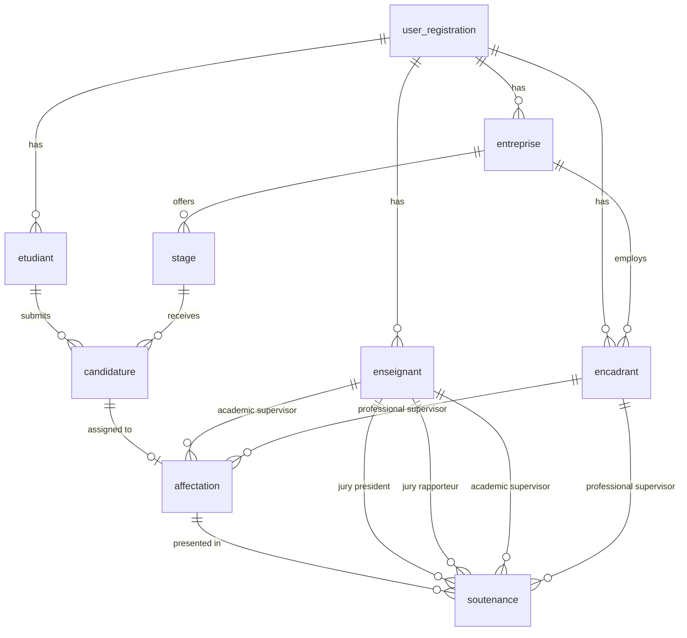

# Design Document: Database Redesign

## Overview

This design document outlines the comprehensive database schema redesign for the Gestion des Stages (Internship Management Platform). The current database structure suffers from several critical issues including improper foreign key relationships, data redundancy, lack of cascading operations, and poor normalization. This redesign addresses all requirements from the requirements.md file with a focus on data integrity, performance, and maintainability.

### Key Design Goals
1. **Proper Foreign Key Relationships**: Explicit definition of all relationships with appropriate ON DELETE/ON UPDATE actions
2. **Data Normalization**: Elimination of data redundancy through proper table design
3. **Cascading Operations**: Predictable data management through cascading deletes and updates
4. **Performance Optimization**: Strategic indexing and appropriate data types
5. **Maintainability**: Clear documentation and consistent naming conventions

## Architecture

### Database Architecture Pattern
The redesigned database follows a **relational database model** with a **centralized authentication system** and **normalized entity relationships**. The architecture consists of:

1. **Core Authentication Layer**: Central `user_registration` table serving as the single source of truth for user authentication
2. **Entity Tables**: Specialized tables for each user type (Etudiant, Enseignant, Encadrant, Entreprise)
3. **Business Logic Tables**: Tables supporting the internship management workflow (Stage, Candidature, Affectation, Soutenance)
4. **Relationship Tables**: Tables defining relationships between entities with proper foreign key constraints

### Technology Stack
- **Database**: MySQL 8.0+ (InnoDB engine for foreign key support)
- **ORM**: Sequelize.js for model definition and migration
- **Application**: Node.js/Express backend
- **Key Features**: Transactions, ACID compliance, referential integrity

## Components and Interfaces

### Core Tables

#### 1. user_registration (Central Authentication)
```sql
CREATE TABLE user_registration (
    user_id INT PRIMARY KEY AUTO_INCREMENT,
    uuid VARCHAR(36) UNIQUE NOT NULL,
    email VARCHAR(255) UNIQUE NOT NULL,
    password_hash VARCHAR(255) NOT NULL,
    role ENUM('STUDENT', 'TEACHER', 'SUPERVISOR', 'COMPANY', 'ADMIN') NOT NULL,
    is_active BOOLEAN DEFAULT TRUE,
    created_at TIMESTAMP DEFAULT CURRENT_TIMESTAMP,
    updated_at TIMESTAMP DEFAULT CURRENT_TIMESTAMP ON UPDATE CURRENT_TIMESTAMP,
    INDEX idx_email (email),
    INDEX idx_role (role)
) ENGINE=InnoDB COMMENT='Central authentication table for all users';
```

#### 2. etudiant (Student Profile)
```sql
CREATE TABLE etudiant (
    etudiant_id INT PRIMARY KEY AUTO_INCREMENT,
    user_id INT NOT NULL,
    uuid VARCHAR(36) UNIQUE NOT NULL,
    nom VARCHAR(100) NOT NULL,
    prenom VARCHAR(100) NOT NULL,
    sexe ENUM('M', 'F') NOT NULL,
    departement VARCHAR(100) NOT NULL,
    specialite VARCHAR(100) NOT NULL,
    date_naissance DATE,
    telephone VARCHAR(20),
    created_at TIMESTAMP DEFAULT CURRENT_TIMESTAMP,
    updated_at TIMESTAMP DEFAULT CURRENT_TIMESTAMP ON UPDATE CURRENT_TIMESTAMP,
    FOREIGN KEY (user_id) 
        REFERENCES user_registration(user_id) 
        ON DELETE CASCADE 
        ON UPDATE CASCADE,
    INDEX idx_user_id (user_id),
    INDEX idx_uuid (uuid),
    INDEX idx_departement (departement)
) ENGINE=InnoDB COMMENT='Student profile information';
```

#### 3. enseignant (Academic Teacher/Supervisor)
```sql
CREATE TABLE enseignant (
    enseignant_id INT PRIMARY KEY AUTO_INCREMENT,
    user_id INT NOT NULL,
    email VARCHAR(255) UNIQUE NOT NULL,
    nom VARCHAR(100) NOT NULL,
    prenom VARCHAR(100) NOT NULL,
    sexe ENUM('M', 'F') NOT NULL,
    departement VARCHAR(100) NOT NULL,
    grade VARCHAR(50),
    telephone VARCHAR(20),
    created_at TIMESTAMP DEFAULT CURRENT_TIMESTAMP,
    updated_at TIMESTAMP DEFAULT CURRENT_TIMESTAMP ON UPDATE CURRENT_TIMESTAMP,
    FOREIGN KEY (user_id) 
        REFERENCES user_registration(user_id) 
        ON DELETE CASCADE 
        ON UPDATE CASCADE,
    INDEX idx_user_id (user_id),
    INDEX idx_email (email),
    INDEX idx_departement (departement)
) ENGINE=InnoDB COMMENT='Academic teacher/supervisor information';
```

#### 4. encadrant (Professional Supervisor)
```sql
CREATE TABLE encadrant (
    encadrant_id INT PRIMARY KEY AUTO_INCREMENT,
    user_id INT NOT NULL,
    email VARCHAR(255) UNIQUE NOT NULL,
    nom VARCHAR(100) NOT NULL,
    prenom VARCHAR(100) NOT NULL,
    sexe ENUM('M', 'F') NOT NULL,
    entreprise_id INT,
    poste VARCHAR(100),
    telephone VARCHAR(20),
    created_at TIMESTAMP DEFAULT CURRENT_TIMESTAMP,
    updated_at TIMESTAMP DEFAULT CURRENT_TIMESTAMP ON UPDATE CURRENT_TIMESTAMP,
    FOREIGN KEY (user_id) 
        REFERENCES user_registration(user_id) 
        ON DELETE CASCADE 
        ON UPDATE CASCADE,
    FOREIGN KEY (entreprise_id) 
        REFERENCES entreprise(entreprise_id) 
        ON DELETE SET NULL 
        ON UPDATE CASCADE,
    INDEX idx_user_id (user_id),
    INDEX idx_email (email),
    INDEX idx_entreprise_id (entreprise_id)
) ENGINE=InnoDB COMMENT='Professional supervisor from industry';
```

#### 5. entreprise (Company/Organization)
```sql
CREATE TABLE entreprise (
    entreprise_id INT PRIMARY KEY AUTO_INCREMENT,
    user_id INT NOT NULL,
    nom VARCHAR(200) NOT NULL,
    domaine VARCHAR(100) NOT NULL,
    ville VARCHAR(100) NOT NULL,
    adresse TEXT NOT NULL,
    telephone VARCHAR(20) NOT NULL,
    email VARCHAR(255) UNIQUE NOT NULL,
    site_web VARCHAR(255),
    created_at TIMESTAMP DEFAULT CURRENT_TIMESTAMP,
    updated_at TIMESTAMP DEFAULT CURRENT_TIMESTAMP ON UPDATE CURRENT_TIMESTAMP,
    FOREIGN KEY (user_id) 
        REFERENCES user_registration(user_id) 
        ON DELETE CASCADE 
        ON UPDATE CASCADE,
    INDEX idx_user_id (user_id),
    INDEX idx_email (email),
    INDEX idx_domaine (domaine),
    INDEX idx_ville (ville)
) ENGINE=InnoDB COMMENT='Company/organization offering internships';
```

### Business Logic Tables

#### 6. stage (Internship Opportunity)
```sql
CREATE TABLE stage (
    stage_id INT PRIMARY KEY AUTO_INCREMENT,
    entreprise_id INT NOT NULL,
    titre VARCHAR(200) NOT NULL,
    domaine VARCHAR(100) NOT NULL,
    description TEXT NOT NULL,
    niveau_requis ENUM('LICENCE', 'MASTER', 'DOCTORAT', 'AUTRE') NOT NULL,
    experience_requise VARCHAR(100),
    langue_requise VARCHAR(100),
    postes_vacants INT DEFAULT 1,
    date_debut DATE NOT NULL,
    date_fin DATE NOT NULL,
    adresse TEXT NOT NULL,
    ville VARCHAR(100) NOT NULL,
    code_postal VARCHAR(20),
    contact_email VARCHAR(255) NOT NULL,
    contact_telephone VARCHAR(20) NOT NULL,
    is_active BOOLEAN DEFAULT TRUE,
    created_at TIMESTAMP DEFAULT CURRENT_TIMESTAMP,
    updated_at TIMESTAMP DEFAULT CURRENT_TIMESTAMP ON UPDATE CURRENT_TIMESTAMP,
    FOREIGN KEY (entreprise_id) 
        REFERENCES entreprise(entreprise_id) 
        ON DELETE CASCADE 
        ON UPDATE CASCADE,
    INDEX idx_entreprise_id (entreprise_id),
    INDEX idx_domaine (domaine),
    INDEX idx_niveau_requis (niveau_requis),
    INDEX idx_is_active (is_active),
    INDEX idx_date_debut (date_debut),
    FULLTEXT idx_ft_description (titre, description)
) ENGINE=InnoDB COMMENT='Internship opportunity details';
```

#### 7. candidature (Internship Application)
```sql
CREATE TABLE candidature (
    candidature_id INT PRIMARY KEY AUTO_INCREMENT,
    stage_id INT NOT NULL,
    etudiant_id INT NOT NULL,
    status ENUM('EN_ATTENTE', 'ACCEPTE', 'REFUSE', 'ANNULE') DEFAULT 'EN_ATTENTE',
    
    -- Snapshot of student information at application time
    etudiant_nom VARCHAR(100) NOT NULL,
    etudiant_prenom VARCHAR(100) NOT NULL,
    etudiant_email VARCHAR(255) NOT NULL,
    etudiant_departement VARCHAR(100) NOT NULL,
    etudiant_specialite VARCHAR(100) NOT NULL,
    
    -- Application documents
    cv_path VARCHAR(500),
    lettre_motivation_path VARCHAR(500),
    releves_notes_path VARCHAR(500),
    
    motivation_letter TEXT,
    date_postulation TIMESTAMP DEFAULT CURRENT_TIMESTAMP,
    date_modification TIMESTAMP DEFAULT CURRENT_TIMESTAMP ON UPDATE CURRENT_TIMESTAMP,
    
    FOREIGN KEY (stage_id) 
        REFERENCES stage(stage_id) 
        ON DELETE CASCADE 
        ON UPDATE CASCADE,
    FOREIGN KEY (etudiant_id) 
        REFERENCES etudiant(etudiant_id) 
        ON DELETE CASCADE 
        ON UPDATE CASCADE,
    
    UNIQUE KEY uk_stage_etudiant (stage_id, etudiant_id),
    INDEX idx_stage_id (stage_id),
    INDEX idx_etudiant_id (etudiant_id),
    INDEX idx_status (status),
    INDEX idx_date_postulation (date_postulation)
) ENGINE=InnoDB COMMENT='Student application for internship';
```

#### 8. affectation (Supervisor Assignment)
```sql
CREATE TABLE affectation (
    affectation_id INT PRIMARY KEY AUTO_INCREMENT,
    candidature_id INT NOT NULL,
    enseignant_id INT,  -- Academic supervisor
    encadrant_id INT,   -- Professional supervisor
    date_affectation TIMESTAMP DEFAULT CURRENT_TIMESTAMP,
    notes TEXT,
    created_at TIMESTAMP DEFAULT CURRENT_TIMESTAMP,
    updated_at TIMESTAMP DEFAULT CURRENT_TIMESTAMP ON UPDATE CURRENT_TIMESTAMP,
    
    FOREIGN KEY (candidature_id) 
        REFERENCES candidature(candidature_id) 
        ON DELETE CASCADE 
        ON UPDATE CASCADE,
    FOREIGN KEY (enseignant_id) 
        REFERENCES enseignant(enseignant_id) 
        ON DELETE SET NULL 
        ON UPDATE CASCADE,
    FOREIGN KEY (encadrant_id) 
        REFERENCES encadrant(encadrant_id) 
        ON DELETE SET NULL 
        ON UPDATE CASCADE,
    
    UNIQUE KEY uk_candidature (candidature_id),
    INDEX idx_candidature_id (candidature_id),
    INDEX idx_enseignant_id (enseignant_id),
    INDEX idx_encadrant_id (encadrant_id)
) ENGINE=InnoDB COMMENT='Supervisor assignment for accepted candidatures';
```

#### 9. soutenance (Defense Presentation)
```sql
CREATE TABLE soutenance (
    soutenance_id INT PRIMARY KEY AUTO_INCREMENT,
    affectation_id INT,
    date_soutenance DATE NOT NULL,
    heure_soutenance TIME NOT NULL,
    salle VARCHAR(100) NOT NULL,
    type_presentation ENUM('MONOME', 'BINOME', 'TRINOME') NOT NULL,
    
    -- Student information (can be manually entered for flexibility)
    etudiant1_nom VARCHAR(100) NOT NULL,
    etudiant1_prenom VARCHAR(100) NOT NULL,
    etudiant2_nom VARCHAR(100),
    etudiant2_prenom VARCHAR(100),
    etudiant3_nom VARCHAR(100),
    etudiant3_prenom VARCHAR(100),
    
    -- Jury members
    president_id INT,  -- Reference to enseignant
    rapporteur_id INT, -- Reference to enseignant
    encadrant_academique_id INT, -- Reference to enseignant
    encadrant_professionnel_id INT, -- Reference to encadrant
    
    sujet TEXT NOT NULL,
    entreprise_nom VARCHAR(200),
    notes TEXT,
    created_at TIMESTAMP DEFAULT CURRENT_TIMESTAMP,
    updated_at TIMESTAMP DEFAULT CURRENT_TIMESTAMP ON UPDATE CURRENT_TIMESTAMP,
    
    FOREIGN KEY (affectation_id) 
        REFERENCES affectation(affectation_id) 
        ON DELETE SET NULL 
        ON UPDATE CASCADE,
    FOREIGN KEY (president_id) 
        REFERENCES enseignant(enseignant_id) 
        ON DELETE SET NULL 
        ON UPDATE CASCADE,
    FOREIGN KEY (rapporteur_id) 
        REFERENCES enseignant(enseignant_id) 
        ON DELETE SET NULL 
        ON UPDATE CASCADE,
    FOREIGN KEY (encadrant_academique_id) 
        REFERENCES enseignant(enseignant_id) 
        ON DELETE SET NULL 
        ON UPDATE CASCADE,
    FOREIGN KEY (encadrant_professionnel_id) 
        REFERENCES encadrant(encadrant_id) 
        ON DELETE SET NULL 
        ON UPDATE CASCADE,
    
    INDEX idx_affectation_id (affectation_id),
    INDEX idx_date_soutenance (date_soutenance),
    INDEX idx_type_presentation (type_presentation)
) ENGINE=InnoDB COMMENT='Defense presentation scheduling';
```

## Data Models

### Entity-Relationship Diagram



### Relationship Matrix

| Parent Table | Child Table | Relationship Type | ON DELETE | ON UPDATE | Notes |
|--------------|-------------|------------------|------------|------------|--------|
| user_registration | etudiant | One-to-One | CASCADE | CASCADE | Student profile |
| user_registration | enseignant | One-to-One | CASCADE | CASCADE | Teacher profile |
| user_registration | encadrant | One-to-One | CASCADE | CASCADE | Professional supervisor |
| user_registration | entreprise | One-to-One | CASCADE | CASCADE | Company profile |
| entreprise | stage | One-to-Many | CASCADE | CASCADE | Company offers internships |
| entreprise | encadrant | One-to-Many | SET NULL | CASCADE | Company employs supervisors |
| stage | candidature | One-to-Many | CASCADE | CASCADE | Internship receives applications |
| etudiant | candidature | One-to-Many | CASCADE | CASCADE | Student submits applications |
| candidature | affectation | One-to-One | CASCADE | CASCADE | Application gets assignment |
| enseignant | affectation | One-to-Many | SET NULL | CASCADE | Teacher supervises applications |
| encadrant | affectation | One-to-Many | SET NULL | CASCADE | Professional supervises applications |
| affectation | soutenance | One-to-One | SET NULL | CASCADE | Assignment presented in defense |
| enseignant | soutenance | One-to-Many | SET NULL | CASCADE | Teacher serves as jury |
| encadrant | soutenance | One-to-Many | SET NULL | CASCADE | Professional serves as jury |

### Data Normalization Approach

#### 1. First Normal Form (1NF)
- All tables have primary keys
- All columns contain atomic values
- No repeating groups
- Each column has a single data type

#### 2. Second Normal Form (2NF)
- All non-key attributes fully dependent on primary key
- Removal of partial dependencies
- Example: Student information split between `etudiant` and `candidature` snapshot

#### 3. Third Normal Form (3NF)
- Removal of transitive dependencies
- Derived data not stored redundantly
- Example: Company information referenced, not duplicated in `stage`

#### 4. Boyce-Codd Normal Form (BCNF)
- Every determinant is a candidate key
- Elimination of overlapping candidate keys
- Applied to all relationship tables

### Snapshot Strategy
For mutable data that needs historical preservation:
- `candidature` stores snapshot of student information at application time
- This allows student profile updates without affecting historical applications
- Foreign keys maintain referential integrity to current records

## Correctness Properties

*A property is a characteristic or behavior that should hold true across all valid executions of a system-essentially, a formal statement about what the system should do. Properties serve as the bridge between human-readable specifications and machine-verifiable correctness guarantees.*