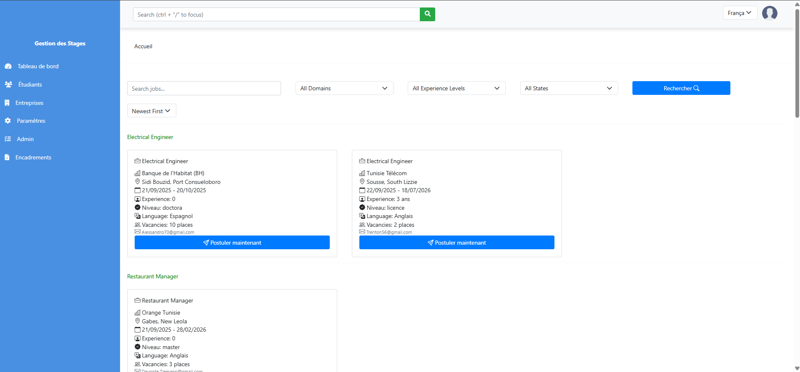
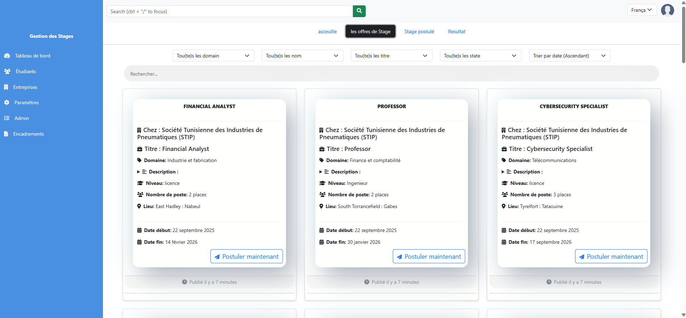
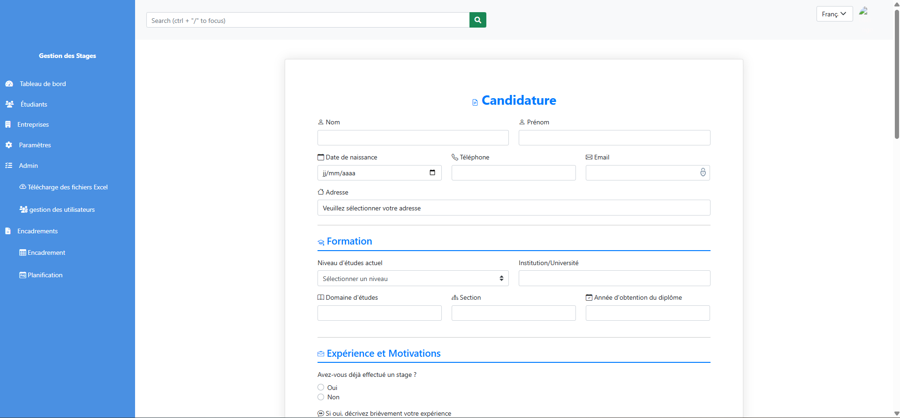

# Gestion des Stages - Application Web

## Présentation

Ce projet est une application web dédiée à la **gestion des stages** pour les établissements d'enseignement supérieur. Il facilite la mise en relation entre étudiants, entreprises/sociétés, départements scolaires et coordinateurs de stages.

### Objectifs

- Centraliser la gestion des offres de stage et des candidatures.
- Suivre le parcours des stagiaires, de la postulation à la soutenance.
- Simplifier la communication entre tous les acteurs impliqués.

## Acteurs du système

- **Étudiant** : consulte les offres, postule, suit ses candidatures et stages.
- **Stagiaire** : suit l'évolution de son stage et prépare sa soutenance.
- **Département / École** : publie des offres, valide les conventions, planifie les soutenances.
- **Entreprise / Société** : propose des stages, gère les candidatures, prend des décisions.
- **Coordinateur** : supervise le processus, gère les affectations et le suivi.

## Fonctionnalités principales

- Publication et gestion des offres de stage.
- Système de candidature en ligne avec dépôt de documents.
- Suivi des candidatures et des statuts.
- Gestion des conventions et planification des soutenances.
- Notifications par email.
- Stockage sécurisé des fichiers sur Google Drive.

## Configuration du fichier `.env`

Remplacez chaque valeur par vos propres informations :

```
DATABASE_DIALECT= # Exemple: mysql
DATABASE_HOST= # Adresse de votre serveur MySQL
DATABASE_NAME= # Nom de votre base de données
DATABASE_PASSWORD= # Mot de passe de la base de données
DATABASE_PORT= # Port MySQL (ex: 3306)
DATABASE_USER= # Utilisateur MySQL
FRONTEND_URL= # URL de votre frontend (ex: https://votre-app.com)
GOOGLE_CREDENTIALS= # Clé de service Google Drive (format JSON)
GOOGLE_DRIVE_STORAGES= # ID du dossier Google Drive
JWT_SECRET= # Clé secrète JWT pour l'authentification
NODEMAILER_PASS= # Mot de passe d'application Gmail
NODEMAILER_USER= # Adresse email pour l'envoi des mails
secretKey= # Clé secrète pour la sécurité
```

## Structure du projet

```
PFE--
│
├── controllers/      # Logique métier, gestion des requêtes
├── emails/           # Gestion et templates des emails
├── middleware/       # Middlewares Express (auth, validation, etc.)
├── model/            # Modèles Sequelize pour la base de données
├── routes/           # Routes Express pour chaque acteur et fonctionnalité
├── views/            # Templates EJS pour le rendu côté client
├── public/           # Fichiers statiques (CSS, JS, images)
├── stockages/        # Stockage local des fichiers uploadés
├── connection/       # Pages et logique de connexion/authentification
├── server.js         # Point d'entrée du serveur Node.js
└── .env              # Configuration des variables d'environnement
```

## Technologies utilisées

- **Node.js / Express** : backend et API.
- **Sequelize** : ORM pour MySQL.
- **EJS** : templates côté serveur.
- **Bootstrap** : design responsive.
- **Google Drive API** : stockage des fichiers.
- **Nodemailer** : envoi d'emails.
- **JWT** : authentification sécurisée.

## Installation et exécution

1. **Configurer le fichier `.env`** avec vos propres valeurs.
2. **Installer les dépendances** :
    ```sh
    npm install
    ```
3. **Démarrer le serveur** :
    ```sh
    npm start
    ```
L'application sera accessible via l'URL définie dans `FRONTEND_URL`.

## Captures d'écran

Voici quelques aperçus de l'application :


*Page de connexion*


*Tableau de bord étudiant*


*Gestion des offres de stage*


*Suivi des candidatures*

## Contact

Pour toute question ou contribution, contactez :  
`gabiamsamuelnathan@gmail.com`

---

Ce projet vise à moderniser et simplifier la gestion des stages pour tous les acteurs impliqués, en offrant une solution centralisée, sécurisée et évolutive.
